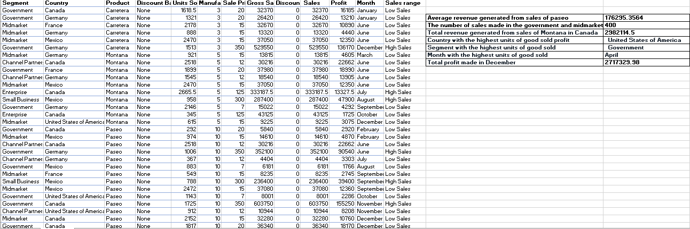

# Advanced Ms Excel functions and formulas

## Introduction

This task was drafted to evaluate mastery of advanced functions and formulas in excel.

## Concept demonstrated 
VLOOKUP, COUNTIF, AVERAGEIF, SUMIFS, SUMIF.

## Problem statement

### 1. The average revenue generated from each sales of Paseo.

To solve this the function AVERAGEIF was used.

### 2. The number of sales generated from the government and midmarket segment.

The answer this question, the function COUNTIF was used and later on the number of sales of each segment was added up.

### 3. The total revenue generated from the sales of "Montana" in Canada.

For this question, the function SUMIFS was of great help.

### 4. In which country, month and segment was the highest unit of goods sold.

The function VLOOKUP was needed here.

### 5. The total profit made in the month of December.

For this question the function SUMIF was used.

## Conclusion

This task aimed at looking into the advanced functions and formulas of Ms excel.

